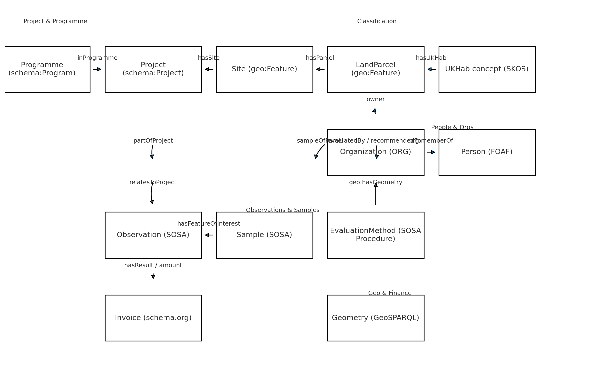

# Landscape Recovery Ontology (LRO)

A lightweight, standards-first ontology for **nature finance & landscape recovery** projects.

- **Prefix / Base IRI:** `lro:` → `https://greatyellow.earth/ontology#`
- **Primary serialization:** Turtle (`ontology/lro.ttl`)
- **Assumptions:** Currency **GBP**, CRS **EPSG:4326**, WKT and GeoJSON stored side-by-side.

> **Announcement / Press Release**  
> 🚀 **Introducing the Landscape Recovery Ontology (LRO)**  
> Today we’re open-sourcing a lightweight ontology for **nature finance & landscape recovery**. It reuses the good stuff—**SOSA/SSN** (observations), **GeoSPARQL 1.1** (geometries), **QUDT** (units), **OWL-Time**, **FOAF/ORG**, **DCTERMS/DCAT/SKOS**—and adds just enough glue for projects, parcels, habitats (UKHab), and measurements.  
>  
> Why care? LRO makes it easier to **find, join, and reason over** ecological & finance data:  
> • “All soil measurements in Project X, 2022–2025”  
> • “Total area under consideration”  
> • “Which landowners have the most chalk grassland?”  
> • “Area-weighted habitat condition by L1 UKHab”  
>  
> Get started in **Protégé** with the Turtle file, sample data, and ready-to-run SPARQL queries. Ontology & docs are **CC BY 4.0**; example code is **MIT**.  
>  
> 📣 We’d love feedback, issues, and contributions—especially mappings to UKHab codes and additional evaluation methods.  
>  
> #ontology #semanticweb #geospatial #biodiversity #naturefinance #geosparql #qudt #openscience

---

## Why another ontology?

This project glues together widely used vocabularies (SOSA/SSN, GeoSPARQL 1.1, OWL-Time, QUDT, FOAF/ORG, DCTERMS/DCAT/SKOS) with minimal new terms for project, parcel, habitat, observation, and finance concepts—aimed at semantic search and reporting for landscape recovery. See our original research spike for background and competency questions. :contentReference[oaicite:5]{index=5}

## Repo layout
```
landscape-recovery-ontology/
├─ README.md
├─ LICENSE # MIT (for code/examples)
├─ LICENSE-CC-BY-4.0 # CC BY 4.0 (for ontology/docs)
├─ CITATION.cff
├─ ontology/
│ └─ lro.ttl
├─ examples/
│ ├─ sample-data.ttl
│ └─ queries/
│   ├─ q1_soil_measurements.rq
│   ├─ q2_total_hectarage.rq
│   ├─ q3_chalk_grassland_owners.rq
│   └─ q4_area_weighted_condition.rq
└─ docs/
  ├─ class-hierarchy-poc.svg
  ├─ dependencies-poc.svg
  └─ ontology-diagram.png
```

## Install / Use

1. **Open in Protégé**  
   - File → Open… → `ontology/lro.ttl`
2. **Load the sample data**  
   - File → Import RDF… → `examples/sample-data.ttl`
3. **Run queries**  
   - Use SPARQL tab in Protégé to run examples from `examples/queries/`.

## Core dependencies (reused vocabularies)

- **SOSA/SSN** for observations/samples/procedures
- **GeoSPARQL 1.1** for features, geometries, and WKT/GeoJSON literals
- **QUDT** for units and quantities (including money)
- **OWL-Time** for project timelines
- **FOAF / ORG** for people & organizations
- **DCTERMS / DCAT / SKOS** for docs, datasets, and controlled code lists

References: SOSA/SSN, GeoSPARQL 1.1, QUDT, OWL-Time, DOAP (example of publishing), OBO/AgrO (licensing). :contentReference[oaicite:6]{index=6}

## Diagram



## Class Hierarchy
```
owl:Thing
├─ lro:Programme                (schema:Program)
├─ lro:Project                  (schema:Project)
├─ lro:Meeting                  (schema:Event)

├─ lro:Site                     (geo:Feature)
│  └─ (holds parcels via lro:hasParcel)

├─ lro:LandParcel               (geo:Feature)
│  ├─ (has geometry via geo:hasGeometry → geo:Geometry)
│  ├─ (classified via lro:hasUKHab → skos:Concept)
│  └─ (owner via lro:owner → foaf:Agent)

├─ lro:Watershed                (geo:Feature)
├─ lro:Location                 (dcterms:Location ∧ geo:Feature)

├─ lro:Visitor                  (foaf:Person)
├─ lro:Ecologist                (foaf:Person)
├─ lro:Investor                 (foaf:Person)
├─ lro:Farmer                   (foaf:Person)

├─ lro:Invoice                  (schema:Invoice)
│  └─ (uses lro:amount → qudt:QuantityValue)

├─ lro:MonetaryValue            (qudt:QuantityValue)

├─ lro:LegalDocument            (dcterms:Document)
├─ lro:FinancialModel           (dcterms:Document)
├─ lro:HydrologicalModel        (dcterms:Document)
├─ lro:TemplateDocument         (dcterms:Document)

├─ lro:HabitatType              (envo:ENVO_00002006)           ; ENVO habitat
├─ lro:EcosystemService         (owl:Class)
├─ lro:EcosystemFunction        (owl:Class)
├─ lro:EcosystemValue           (owl:Class)

├─ lro:SoilSample               (sosa:Sample)
├─ lro:WaterSample              (sosa:Sample)
├─ lro:AirSample                (sosa:Sample)

├─ lro:SpeciesObservation       (sosa:Observation)
│  └─ (links taxon via lro:observedSpecies → dwc:Taxon)

├─ lro:EvaluationMethod         (sosa:Procedure)
├─ lro:HabitatQualityAssessment (sosa:Observation)

# Reused “upper” classes (referenced, not expanded here):
#   geo:Feature, geo:Geometry, sosa:Observation, sosa:Sample, sosa:Procedure,
#   qudt:QuantityValue, time:Interval, dcterms:Document, dcat:Dataset,
#   foaf:Person, org:Organization, gn:Region, dwc:Taxon, envo:ENVO_00002006

```

## SPARQL examples (same as in `examples/queries/`)

- **Q1** – Soil measurements for *Project X* between 2022 and 2025  
- **Q2** – Aggregate hectarage for parcels under *Project X*  
- **Q3** – Landowners with the highest area of chalk grassland  
- **Q4** – Area-weighted average habitat condition by L1 UKHab in *Project X*

## Versioning & releases

- Version IRI: `https://greatyellow.earth/ontology/0.1.0`
- Changelog in GitHub Releases (tagged versions)
- Cite via `CITATION.cff`.

## License

- **Ontology & docs:** CC BY 4.0 (`LICENSE-CC-BY-4.0`)  
- **Code & examples:** MIT (`LICENSE`)

Rationale: Many ontologies (e.g., **AgrO**) use **CC BY 4.0** for the ontology; tooling frequently uses MIT/Apache-2.0 (e.g., **DOAP**, **OGC**). :contentReference[oaicite:7]{index=7}

## Contributing

Issues and pull requests are welcome—particularly:  
- SKOS expansion/mapping for **UKHab**  
- Additional **Evaluation Methods** and example datasets  
- Tests for query patterns and unit conversions via QUDT

## References
## References

- Noy, N. F., & McGuinness, D. L. (2001). **Ontology Development 101: A Guide to Creating Your First Ontology.** Stanford KSL/Protégé. PDF. https://protege.stanford.edu/publications/ontology_development/ontology101.pdf  :contentReference[oaicite:0]{index=0}

- Ceccaroni, L., & Oliva, L. (2012). **Ontologies for the Design of Ecosystems.** In *Universal Ontology of Geographic Space: Semantic Enrichment for Spatial Data* (IGI Global). Chapter PDF/TOC: https://igiprodst.blob.core.windows.net/ancillary-files/9781466603271.pdf  (overview page: https://www.igi-global.com/viewtitle.aspx?TitleId=64001).  :contentReference[oaicite:1]{index=1}

- **BFO-2020** (Basic Formal Ontology) — GitHub repository for artifacts conformant with ISO/IEC 21838-2:2020: https://github.com/BFO-ontology/BFO-2020  :contentReference[oaicite:2]{index=2}

- Drakou, E. G., Lemmens, R. L. G., & Ayuninshih, F. (2019). **Designing an Ecosystem Services Ontology within GEOBON.** *Biodiversity Information Science and Standards* 3: e36338. DOI: 10.3897/biss.3.36338. (UTwente record: https://research.utwente.nl/en/publications/designing-an-ecosystem-services-ontology-within-geobon)  :contentReference[oaicite:3]{index=3}

- Bennett, B. (2010). **Foundations for an Ontology of Environment and Habitat.** In *FOIS 2010: Formal Ontology in Information Systems* (IOS Press), pp. 31–44. (ACM/IOS references and metadata)  https://dl.acm.org/doi/proceedings/10.5555/1804715  :contentReference[oaicite:4]{index=4}

- Buttigieg, P. L., et al. (2016). **The environment ontology in 2016: bridging domains with increased scope, semantic density, and interoperation.** *Journal of Biomedical Semantics*. https://jbiomedsem.biomedcentral.com/articles/10.1186/s13326-016-0097-6  :contentReference[oaicite:5]{index=5}

- Affinito, F., Holzer, J. M., Fortin, M.-J., & Gonzalez, A. (2025). **Towards a unified ontology for monitoring ecosystem services.** *Ecosystem Services*. ScienceDirect article page: https://www.sciencedirect.com/science/article/pii/S2212041625000300  :contentReference[oaicite:6]{index=6}
